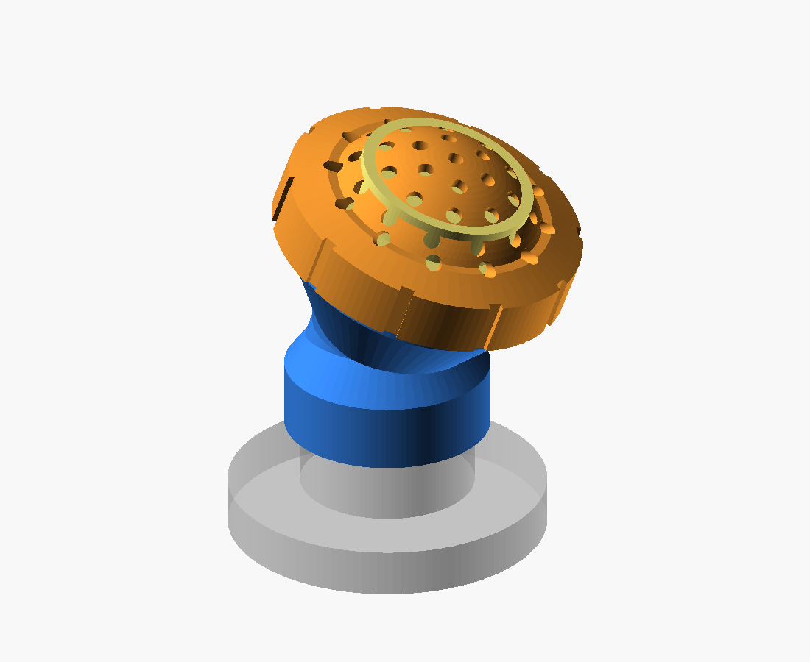
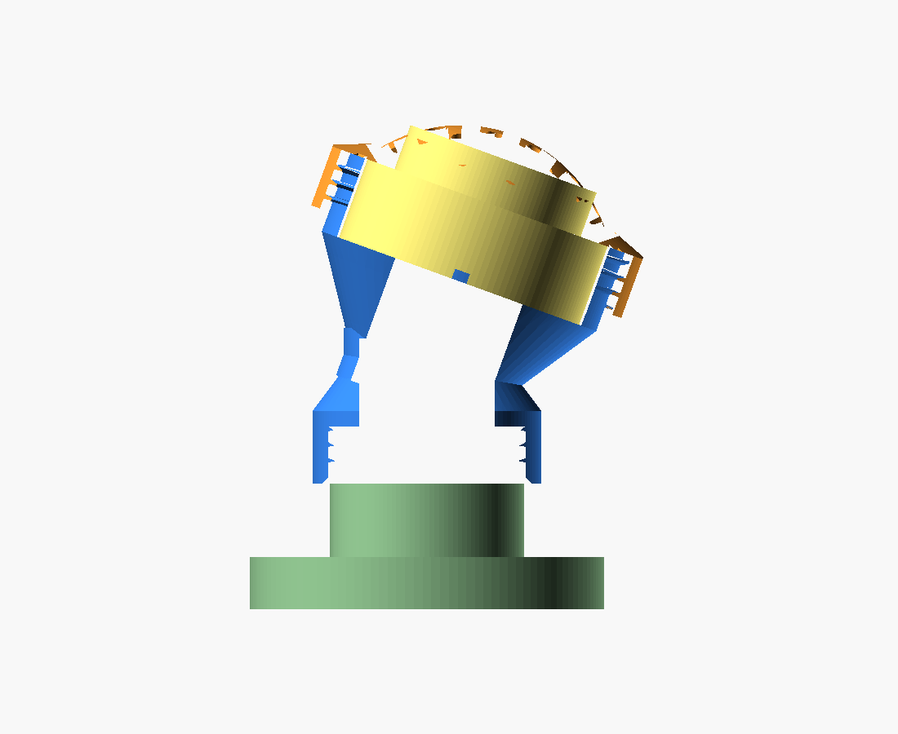
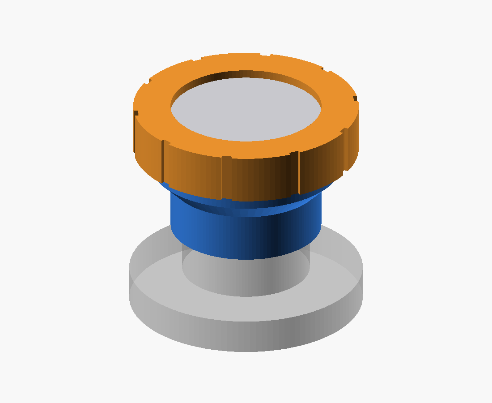
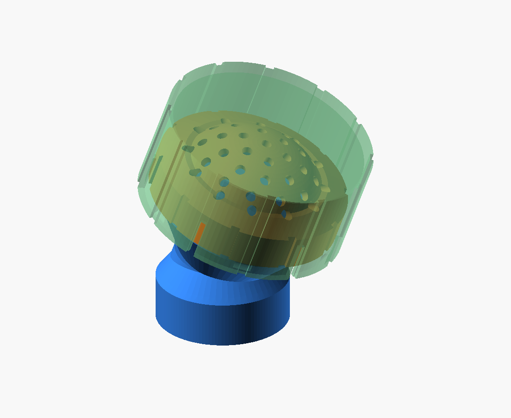
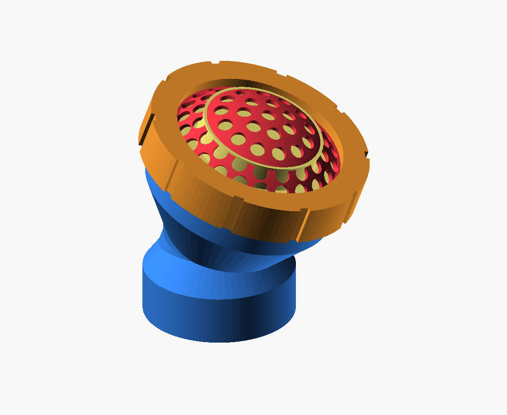
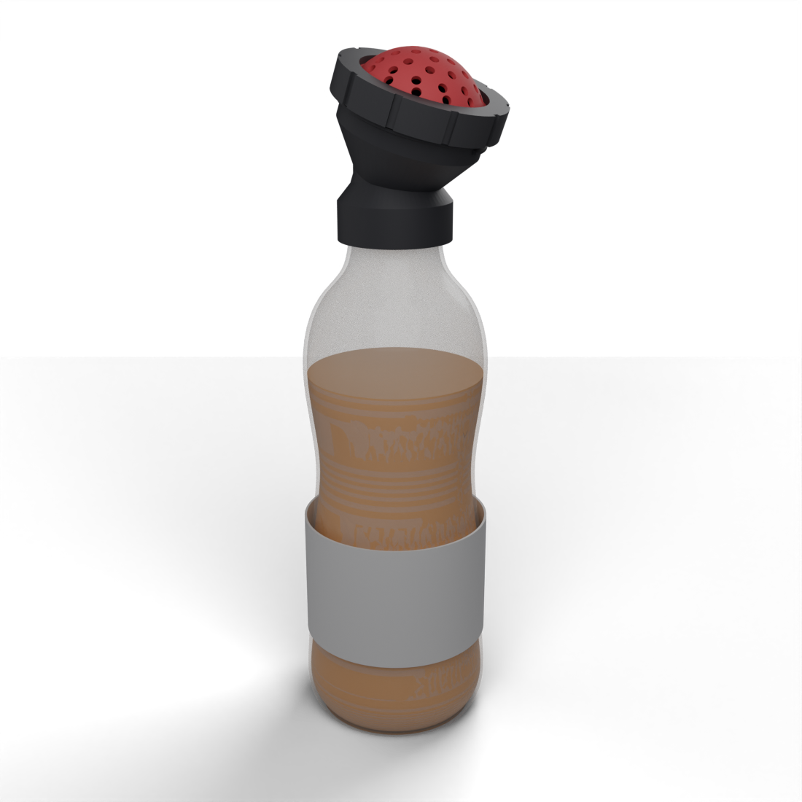
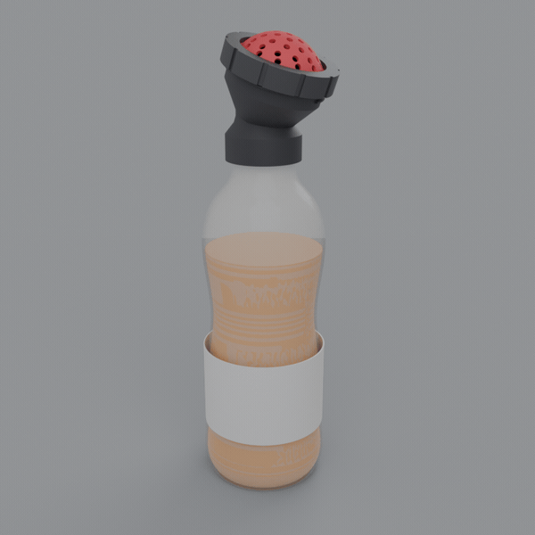

# megamop

A 3D-printable graffiti **mop** (a foam/felt paint dauber, like the old shoe-polish
applicators writers refill with paint) that threads onto a common **Gatorade bottle**.
Big ~2" round tip and a screw-on cap that holds everything together and is swappable.

Two tip closures and two body styles, all sharing one set of parameters:

- **Straight** body (`base.py`) or **angled-neck** body (`base_angled.py`, cup canted
  ~20° so paint feeds the tip when you tilt the bottle toward the wall).
- **Perforated dome cap** (`dome_cap.py`) — a *printed* spherical dome with a grid of
  holes that caps/retains the wick, bulges past the collar for wall contact, and bleeds
  paint through the holes. **No sourced mesh needed.**
- **Flexible TPU dome** (two pieces: `dome_ring.py` rigid + `dome_tpu.py` TPU) — same
  perforated dome but split so the soft face is printed in **TPU** (conforms to brick /
  concrete, won't crack) while a rigid PETG ring keeps a reliable thread. Swappable face.
- Or the simpler **flat collar** (`collar.py`) clamping a separate stainless/Kevlar mesh disc.

### Angled neck + printed dome cap (the current direction)



### Straight body + flat collar (v1)


### Snap-on storage cap (keeps the wet dome from drying / smearing)


### Flexible TPU dome (rigid ring clamps a soft perforated TPU face)


### Textured GLB — the mop on a realistic bottle
`python3 glb_export.py` → **`cad/build/megamop.glb`** (PBR materials: clear bottle + orange
liquid + label, black mop body/ring, red TPU dome; Y-up). Open in Blender, the VS Code glTF
viewer, Windows 3D Viewer, or any three.js viewer — the liquid level shows through the shell.

Photoreal render (headless Blender, via the **product-design** skill):
```
/opt/blender-5.0.1-linux-x64/blender -b -P ~/.claude/skills/product-design/scripts/blender_render.py \
    -- cad/build/megamop.glb cad/build/megamop_blender.png --samples 128
```


360° turntable (`--frames 36 --bg`, stitched with ffmpeg) → `cad/build/megamop_turntable.gif` / `.mp4`:
```
/opt/blender-5.0.1-linux-x64/blender -b -P ~/.claude/skills/product-design/scripts/blender_render.py \
    -- cad/build/megamop.glb cad/build/turntable.png --frames 36 --bg --res 720 --samples 48
ffmpeg -framerate 20 -i cad/build/turntable_%03d.png -vf "palettegen" /tmp/p.png
ffmpeg -framerate 20 -i cad/build/turntable_%03d.png -i /tmp/p.png -lavfi paletteuse -loop 0 cad/build/megamop_turntable.gif
```


## How it works

| part | what it does |
|------|--------------|
| **base** / **base_angled** | screws onto the bottle (internal Gatorade thread), feeds paint up a Ø26 passage (bent through a cylinder-elbow on the angled one) into a ~2" wick chamber, carries an **external** thread for the cap |
| **dome_cap** | screws on; perforated spherical dome retains the wick, bulges past the rim, bleeds paint through a hole grid — *fully printed, replaces the mesh* |
| **dome_ring** + **dome_tpu** | flexible 2-piece version: rigid PETG ring (`dome_ring`) clamps a soft **TPU** perforated dome (`dome_tpu`, two flex variants — `stiff`/`soft`) that conforms to the wall and won't crack |
| **collar** *(alt.)* | flat-lip retainer that clamps a separate mesh disc instead of the dome |
| **cap** | snap-on storage cover — grabs the dome-cap ring (slotted skirt + detents), keeps the wick wet and the dome from smearing in a bag |
| wick *(buy)* | ~Ø50 open-cell foam **or** felt pad — holds/meters the paint |
| mesh *(buy, only with collar)* | ~Ø54 stainless/Kevlar disc |

Squeeze the bottle → paint flows through the feed passage, past a **cross-rib backstop**
(keeps the wick from being sucked back into the bottle), saturates the wick, and bleeds
through the dome holes (or mesh) onto the wall.

## ⚠️ Print the test coupon FIRST

The bottle thread is fully pinned: ~38 mm dia (38-400 T/E: 37.19 / 34.80 mm), **2-start**
(two entries 180° apart), **measured pitch 3.0 mm → lead 6.0 mm**. The coupons just dial the
FDM clearance before you commit to the full base:

```bash
cd cad && python3 coupon.py      # -> build/coupon_snug.stl  (clearance 0.30, 1 nub)
                                 #    build/coupon_loose.stl (clearance 0.40, 2 nubs)
```

Print **both** (~12 mm rings), screw onto the bottle, use whichever threads on snug + clean;
put that value in `THREAD_CLEAR_R`. Everything is parameterized in `cad/machine_params.py`,
so once a coupon fits, every part inherits the correct thread.

## Build / regenerate

```bash
cd cad
python3 threads.py        # thread-generator self-test
python3 base.py           # straight body      -> build/base.stl
python3 base_angled.py    # angled-neck body   -> build/base_angled.stl
python3 dome_cap.py       # perforated dome (1pc) -> build/dome_cap.stl
python3 dome_ring.py      # rigid retainer ring   -> build/dome_ring.stl   (PETG)
python3 dome_tpu.py       # flexible perf. dome (TPU) -> dome_tpu_{stiff,soft}.stl + dome_tpu.stl
python3 collar.py         # flat collar (alt.) -> build/collar.stl
python3 cap.py            # snap-on storage cap -> build/cap.stl
python3 machine.py          # straight assembly + renders
python3 machine_angled.py   # angled assembly  + renders
python3 machine_capped.py   # storage cap fitted + renders
python3 machine_flex.py     # two-piece TPU dome + renders
python3 bottle.py           # realistic Gatorade-style bottle (viz only)
python3 glb_export.py       # -> build/megamop.glb  (mop on a bottle, PBR materials)
MACHINE=megamop_angled NOTE=note bash snap.sh   # log a dated render frame
```

All parts self-verify on build (watertight / single-body / bbox printout).

## Print settings (starting point)

- **Material:** PETG (paint-solvent tolerance, toughness) or PLA for a fit test.
- **base / base_angled:** print **skirt-down** (cup opening up). The feed-bore cross-rib
  bridges ~26 mm and may sag (cosmetic). The angled body has a necked elbow — fine skirt-down.
- **dome_cap:** print **ring-down / dome-up**. The dome is a perforated shell, so the
  upper (shallow) portion near the apex may want a touch of support or a well-tuned bridge;
  the holes are small enough to bridge. If it's fussy, drop `DOME_RISE` or add supports.
- **dome_ring:** rigid (PETG/PLA), threads-down. *Never print threads in TPU* — they delaminate
  in shear; that's why the thread lives on this rigid ring and the soft face is a separate part.
- **dome_tpu:** **TPU (~95A)**, flange-down / dome-up. Slow, no/low retraction. Two flex variants
  (`stiff`/`soft`) — print both and pick; soften further with thinner shell or lower durometer.
- **Two-piece tip is two SEPARATE single-material prints** (ring in PETG, dome in TPU) — no
  multi-material needed. If you do one plate: keep them separate objects, assign a filament each,
  and run TPU from the **external spool** (it jams in the AMS). The parts clamp together after.
- **collar:** print **aperture-face-down** (lip flat on the bed).
- **cap:** print **closed-top-down** (flat top on the bed); slots and grip print vertically,
  the internal snap detents are small bridged overhangs. Tune snap force with `CAP_DETENT`.
- 3+ perimeters, 0.2 mm layers. Coarse threads usually print support-free; the coupon confirms.

## Assembly (dome-cap version)

1. Drop the **wick** into the base cup (proud of the rim).
2. Screw the **dome_cap** down — it compresses the wick so the foam mushrooms up through
   the dome throat and presses on the perforated shell.
3. Screw onto a paint-filled Gatorade bottle. Squeeze + drag.

## Key parameters (`cad/machine_params.py`)

`BOTTLE_THREAD_*` (verify w/ coupon) · `WICK_D` 50 (~2") · `CANT_DEG` 20 (angled tilt) ·
`DOME_RISE` 14 / `DOME_T` 2.6 / `DOME_HOLE_D` 3.6 (dome) · `DTPU_T` 1.8 (TPU flex) ·
`CAP_DETENT` 1.4 (snap force) · `THREAD_CLEAR_R` 0.35 (FDM fit) · `CUP_THREAD_*` (base↔cap thread).

## Status / deferred
Done: straight + 20° angled bodies; three tip closures (flat collar, 1-piece printed dome,
2-piece rigid-ring + flexible TPU dome, with stiff/soft dome variants); snap-on storage cap;
**bottle thread validated on hardware** (38-400, 2-start, pitch 3.0, thin profile).

## Roadmap / ideas
- **Full 90° neck variant** — `CANT_DEG` bump from 20°; the cylinder-elbow + bored passage will
  need geometry work at 90° (sharper turn, inside-of-bend wall).
- **Dome / screen tweaks** — iterate the perforation + flex after field-testing the soft dome.
- **Trigger-handle pressurized version** *(bigger pivot)* — bottle inverted (gravity feed), a
  trigger to pump/squeeze paint out, pressurized feed. A pump/valve mechanism (sealed joints,
  check valves, trigger linkage) rather than a squeeze-bottle mop.
- Earlier deferred: chisel/angled *face*, drip control.
