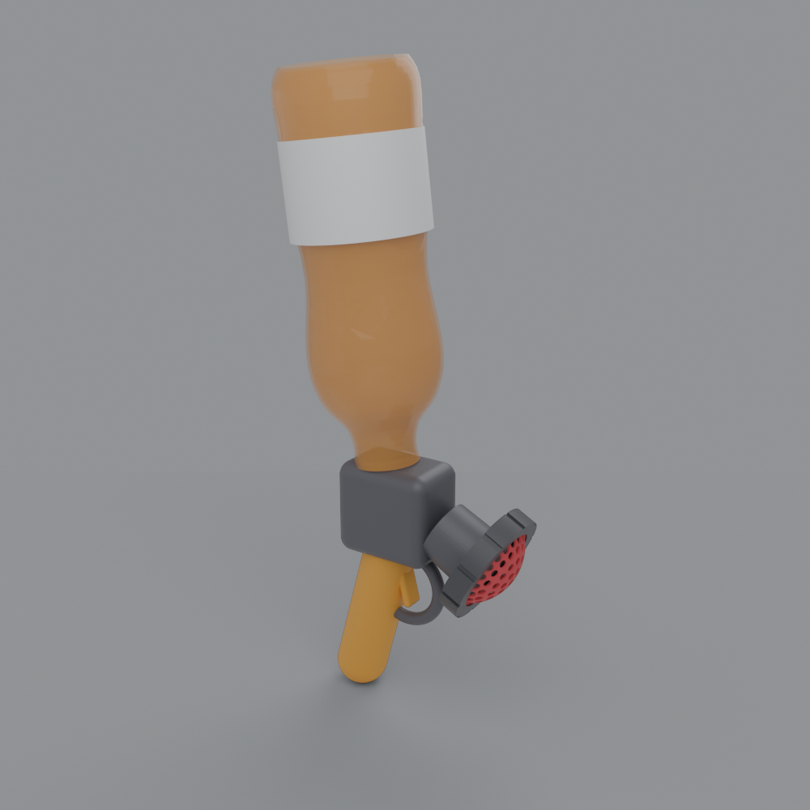
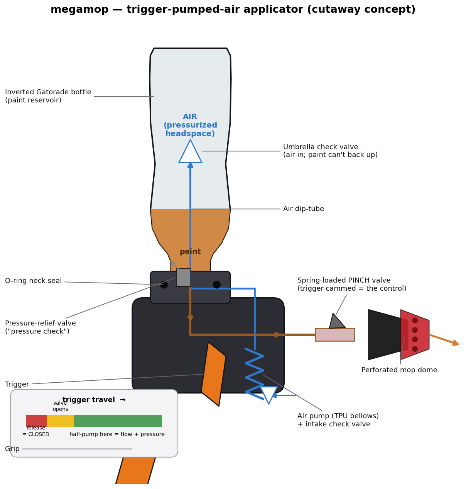

# Concept: trigger-bottle paint applicator

A form study (not a working design) for a future direction: a **trigger-handle applicator** with
an **inverted Gatorade bottle** as the paint reservoir, where pulling a trigger meters paint out
the perforated mop dome. Reuses the real bottle + dome for context; body/grip/trigger are notional.

Build it: `python3 cad/concept_trigger.py` → `cad/build/concept_trigger.glb` + render PNGs.
Renders via the `product-design` skill (Blender, `LC_ALL=C`).

## Status: interesting, NOT resolved
The form reads, but it doesn't work as-is — the full-size bottle dominates the ergonomics, and
**the mechanism is the unsolved part.** The crux: get viscous, pigmented paint to flow *on demand*
from an inverted reservoir, hand-triggered, and still be **cleanable**.

## Candidate mechanisms (for whoever picks this up)
1. **Trigger pinch-valve (simplest, most cleanable).** Paint gravity-/squeeze-feeds through a soft
   tube; the trigger pinches the tube to stop flow, releases it to let paint through. Only wetted
   moving part is the tube (cheap to clean/replace). No pump — pressure comes from gravity + a
   bottle squeeze. Effectively adds **drip control** to today's squeeze mop. Good first step.
2. **Diaphragm / piston trigger pump.** Trigger drives a piston or diaphragm in a chamber with two
   **ball check valves** (inlet from reservoir, outlet to tip) + a return spring; meters a shot per
   pull (trigger-sprayer principle). Real flow control, but internal valves clog with paint — needs
   wide bores and tool-free disassembly to clean.
3. **Pressurized reservoir + trigger shutoff.** Pre-pressurize the bottle (hand pump, or just
   squeeze), trigger is only an on/off valve. Needs sealed, pressure-holding joints (o-rings); a
   Gatorade bottle isn't pressure-rated, so low pressure only — and messy if it lets go.

**Shared gotchas:** an inverted bottle dribbles unless there's a **positive shutoff at the tip**;
viscous paint wants **wide passages + cleanable (ball) valves**; o-rings/gaskets are needed
anywhere pressure is held (printed threads alone won't seal).

## Leading idea — trigger-pumped AIR, valve-phased (refined)

*(regenerate: `python3 cad/concept_trigger_cutaway.py` — air path blue, paint path amber)*

Pump **air** (not paint) into the inverted bottle's headspace through a dip-tube, pressurizing it
to push paint out the tip; the *same* trigger also gates a pinch valve. **Key win: the pump only
moves air, so it never clogs** — the only paint-wetted moving part is a replaceable pinch tube at
the tip. (It's a pump-pot / pressurized sprayer, with the pump + valve folded into the trigger.)

How it goes together:
- **Air pump on the trigger** — a TPU bellows/diaphragm is ideal (printable, no sliding seal).
- **Intake check valve** — admits air on the return stroke.
- **Air dip-tube up to the headspace**, with a **one-way (umbrella/duckbill) valve at its top** so
  paint can't come back down the air tube when the tool is tilted.
- **Sealed neck cap (o-ring)** so the bottle holds a few psi.
- **Pressure-relief valve** (the "pressure check") to cap pressure — a Gatorade bottle isn't
  pressure-rated, so keep it low.
- **Spring-loaded pinch valve at the tip** — released = pinched (positive shutoff, no dribble);
  pulled = open.

**The trigger "balance" (the clever core):** phase the linkage (cam / lost-motion) so the **valve
opens early in the pull and stays open**, the **air pump strokes through the later travel**, and
the **valve only re-closes at full release**. So you can *half-pump* from a part-pulled position to
keep topping up pressure while paint keeps flowing — the balance described. Tunable via the cam
profile; a MuJoCo sim of the linkage would dial the timing.

Tradeoffs: some paints foam under pressurized air; paint can creep into the air tube if tilted
(umbrella valve mitigates); low pressure only; more parts than a squeeze mop. But pumping air, not
paint, is what makes it practical.

## Pragmatic path
**Pragmatic path:** start with #1 (a trigger pinch-valve for drip control on the existing squeeze
action) — achievable and cleanable — then graduate to #2 if you want true metered pumping. This is
`build123d-machine` territory (multi-part mechanism + mates), and a good candidate for a `kickoff`
to choose pump-vs-pressurized and a MuJoCo sim of the trigger/valve motion before CAD.
